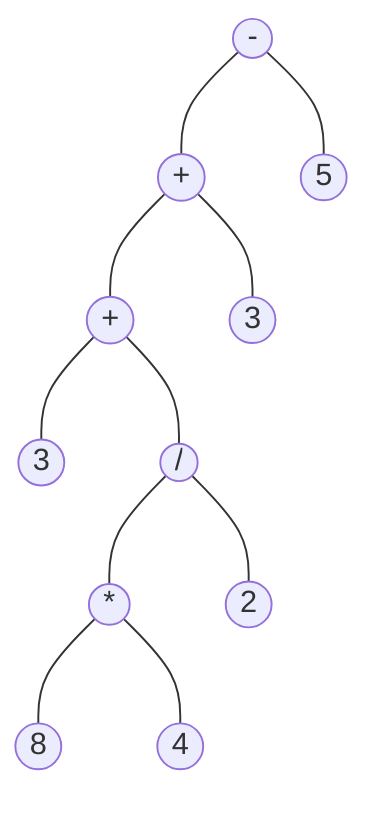
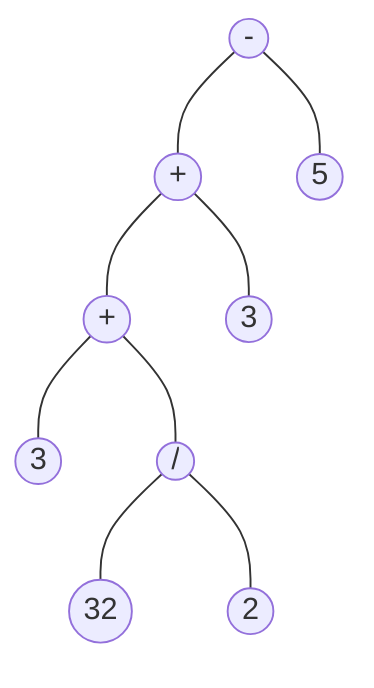
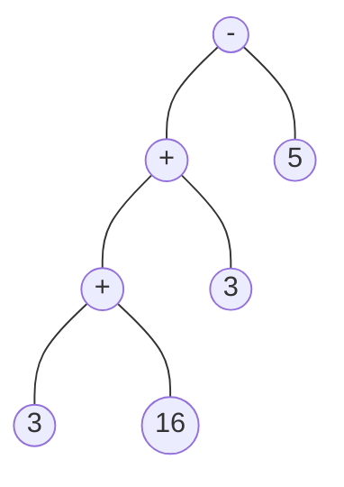
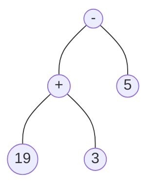
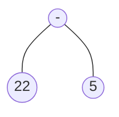

# "Automatas" en C
Trabajo prático N°2, en este TP aprendemos a comprobar el tipo de cadena; `nada`, `octal`, `decimal` o `hexadecimal`. En caso de ser decimales y tener operaciones aritméticas realizamos cálculo de la misma y recibimos su resultado.
Sumado a todo esto también contamos la cantidad de grupos correctos que existen.

## Integrantes
| Nombre & Apellido | Nro. Legajo |
| --- | --- |
| Dimitri Isakow | 164.780-5 |
| Nahuel Alejandro García | 208.997-0 |
| Martín Gonzalo Larrart | 209.042-9 |
| Pedro Jose Nicolas Alvarez | 177.232-6 |

## PDF & Caratula


# Introducción 
Verificamos todas las entradas de cadena separados con el símbolo `$`, si son decimales con operadores verificamos si podemos resolver 
la ecuación, en caso de poder resolverlo el programa lo resuelve finalmente presentamos la cantidad de grupos.
Para la resolución de operaciones aritméticas en una cadena es necesario pasar la notación `infija` a notación `polaca inversa` la idea se sacó de la guía teórica de `Matemática Discreta Unidad 9 página 129`

# Compilación
En la ruta absoluta del directorio `02-Automatas` invocar con CMD `gcc main.c -o main.exe --std=c11` 
Debido a que GCC no admite la función `_strrev()` [^strrev] para revertir el orden de la cadena (necesaria para crear arbol binario) se creo la susodicha con el macros definido para compilar en GCC. El MSVC ya cuenta con esta función de librería

# Ejemplo de ejecución del programa
Un ejemplo con argumento al ejecutar el programa puede ser:

`main.exe 012$51tyia6$fc81$3+4*8/2+3-5 pepe$2*4+3/9-2$516731$0xFBA51$juan$49719$4++9-3*6$-971` cuyo resultado:
<blockquote>
	 Cadena: octal de '012'<br>
	 Error lexico en '51tyia6'<br>
	 Error lexico en 'fc81'<br>
	 Resultado de 3+4*8/2+3-5: 17.000000<br>
	 Error lexico en 'pepe'<br>
	 Resultado de 2*4+3/9-2: 6.333333<br>
	 Cadena: octal de '516731'<br>
	 Cadena: hexadecimal de '0xFBA51'<br>
	 Error lexico en 'juan'<br>
	 Cadena: decimal de '49719'<br>
	 Error lexico en '4++9-3*6' el programa no puede realizar calculos<br>
	 Cadena: decimal de '-971'<br>
	 Cantidad de grupo error lexico: 5<br>
	 Cantidad de grupo octal: 2<br>
	 Cantidad de grupo decimal: 2<br>
	 Cantidad de grupo hexadecimal: 1<br>
</blockquote>
</img>

## [Librería comunes](libs/common.h)
<details open>
  <summary>Funciones esenciales</summary>
	
Instanciamos un arreglo de 4 operadores, los números provienen de la tabla ASCII [^ascii] donde cada char pertenece un entero sin signar de 8 bit (0-255)
```c
int operators[] = { 42,47,45,43 }; 
```

## Cabeceras
```c
enum TipoDeCadena { none, octal, decimal, hexadecimal };
int char_to_int(char ch);
int is_operator(int ascii);
int is_possible_calculate(const char* eq); 
int contain_operator(const char* str);
int op_precedence(char c);
enum TipoDeCadena get_type(const char* str);
char* add_parenthesis(const char* eq);
```

## Explicación de algunas funciones
`strlen(str)` [^strlen]<br>
Primero pasamos a `tolower(str[i]);` [^tolow] para obtener los caracteres en minúsculas, de esta forma tenemos más control. Como se puede ver en la tabla de [^ascii] los números inferiores a 48 se encuentran caracteres que no nos interesa comprobar lo mismo para superiores a 102 entonces si algún carácter posee entre [0-47] y [103-255] (ya que el 102 es `f` y la misma pertenece a los caracteres hexadecimales) retornamos none mejor dicho sería un error léxico. Exceptuando si se tratara de operadores que se encuentra en 42, 43, 45 y 47.
Los que cumplen con el criterio se va asignado el tipo de cadena que es; octal, decimal, etc.
```c
inline enum TipoDeCadena get_type(const char* str)
{
	enum TipoDeCadena explicit_type = none;
	for (size_t i = 0; i < strlen(str); i++)
	{
		const int low = tolower(str[i]);
		if (is_operator(low)) //Excluir los que contienen operaciones, ya que solo validamos cadena aunque la cadena tenga signo con decimal, retorna decimal igual.
			continue;
		if (low < 48 || low > 102)
			return none;
		if (low >= 48 && low <= 55) {
			if ((int)explicit_type < octal)
				explicit_type = octal;
			if (low > 55 && low <= 57)
				explicit_type = decimal;
		}
		else if (isdigit(low)) {
			if((int)explicit_type < decimal)
				explicit_type = decimal;
		}
		else
			explicit_type = hexadecimal;
	}
	return explicit_type;
}
```

La otra función esencial que forma fuertemente parte del ejercicio es la conversión del `char a enteros`
Observando [^ascii] podemos ver que si el char es un decimal (entre 0 y 9) el char forma parte entre 48 y 57 de la tabla ASCII substraemos por el mínimo (48) para representar el entero
```c
inline int char_to_int(char ch)
{
	if(isdigit(ch))
		return (int)ch - 48;
	return -1;
}
```
</details>

## [Stack (o pilas)](modules/stack.h)
Las funciones claves que utiliza la pila es `pop` y `push` 
Definimos la estructura del stack

```c
#define MAX_STACK 2000 //maximo tamaño
typedef struct stack
{
	char content[MAX_STACK]; //los char representan enteros de tabla ASCII 0-255
	int size; //tamaño de contenido pila
}stack_;
```
`int size` nos ayuda a saber el tamaño del contenido.

¿Por qué la función [POP](https://github.com/haytham2597/SSL/blob/master/02-Automatas/modules/stack.h#L21-L29) no retorna valores? Debido a que en el manejo de notación infija a polaca no necesita observar el valor, sino simplemente sacarlo de la pila.


## [Conversión de notación infija a polaca inversa](modules/usual_to_polaca.h)
<details open>
	<summary>Infija a Polaca inversa</summary>

Para el desarrollo de esta conversión es necesario trabajar con pilas, en el pseudocódigo [^shunting-yard] "replicamos" la funcionalidad en el código con excepción del trabajo de paréntesis ya que el trabajo práctico consiste en trabajarlo sin paréntesis y sin lado de asociatividad (que en ese último caso sería para potencias en vez de propiedades `aritméticas básicas; -,+,/,*`)
En la generación de notación polaca inversa se utiliza 2 pilas: Las pilas de `variables` y las pilas de `símbolos` que corresponde a los números y a las operaciones aritméticas respectivamente.
Las precedencias de operadores se utilizaron del código [^infixtorpncsharp] de [C#:](https://github.com/karimo94/infix-to-rpn/blob/0225cc8b508fb02a8b8b1d87965076c88a174ae8/Program.cs#L56C5-L74C10)
| :warning: El siguiente código es un ejemplo y está escrito en C# |
| --- |
```cs
static int Priority(string c)
{
    if (c == "^")
	return 3;
    else if (c == "*" || c == "/")
	return 2;
    else if (c == "+" || c == "-")
	return 1;
    else
	return 0;
}
```
La condición de precedencia se utilizó proveniente: 
| :warning: El siguiente código es un ejemplo y está escrito en C# |
| --- |
```cs
while(s.Count != 0 && Priority(s.Peek()) >= Priority(c))
```
del código previo [código de C#](https://github.com/karimo94/infix-to-rpn/blob/master/Program.cs)
</details>

## [Arbol binario](modules/binarytree.h)
<details open>
	<summary>Arbol binario</summary>

El arbol binario está compuesto por el nodo padre y sus 2 hijos; Izquierda y Derecha. Cada nodo puede tener subnodo, la misma otro subnodo y así suscesivamente.
Al tratarse de notación polaca inversa se agregan primero subnodos derecha y luego izquierda, si el subnodo es un operador se va trabajando el mismo hasta que ambos subnodos sean números.<br>
El armado del arbol binario [^treebinary] se aprendió con este [link](https://www.scaler.com/topics/binary-tree-in-c/), para realizar el cálculo se fue resolviendo de abajo hacia arriba, es decir se "invirtió" [^iteratetree] el árbol.<br>

| :information_source: El algoritmo resuelve la ecuación retornando coma flotante de doble precisión (double) |
| --- |

Arbol binario de la ecuación del ejemplo: 3+4*8/2+3-5


¿Cómo resuelve el algoritmo en el árbol?
Se va reduciendo desde abajo hacia arriba

- Paso 1



- Paso 2



- Paso 3



- Paso Final



Finalmente operamos 22 - 5 que es igual a 17<br>
**Resultado de la ecuación: 17**
</details>

[^tolow]: [tolower()](https://www.programiz.com/c-programming/library-function/ctype.h/tolower) convierte el carácter mayúscula a minúscula.
[^ascii]: https://elcodigoascii.com.ar
[^strlen]: [strlen()](https://learn.microsoft.com/es-es/cpp/c-runtime-library/reference/strlen-wcslen-mbslen-mbslen-l-mbstrlen-mbstrlen-l?view=msvc-170)
[^shunting-yard]: https://www.andreinc.net/2010/10/05/converting-infix-to-rpn-shunting-yard-algorithm
[^infixtorpncsharp]: https://github.com/karimo94/infix-to-rpn/blob/master/Program.cs
[^strrev]: [Funcion strrev()](https://www.sololearn.com/Discuss/1350351/i-got-the-error-undefined-reference-to-strrev-how-could-i-remove-this), https://github.com/haytham2597/SSL/blob/master/02-Automatas/modules/binarytree.h#L86-L98
[^treebinary]: Observe que en una gran parte del código se realizó sin una copia exacta del link. Se tuvo que rediseñar todo el algoritmo para cumplir el propósito del trabajo práctico.
[^iteratetree]: Tenga en cuenta que no se remodificó el árbol, simplemente se invocó llamadas recursivas sobre subnodos hasta comprobar que tanto izquierda como derecha no sean nulos y tampoco operadores. Para ir resolviendo hasta llegar a la raíz, es decir se fue reduciendo el arbol.
